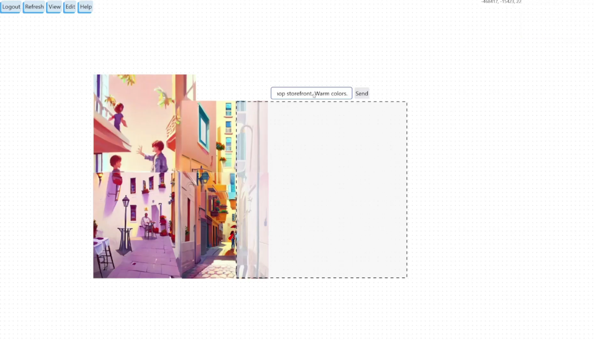
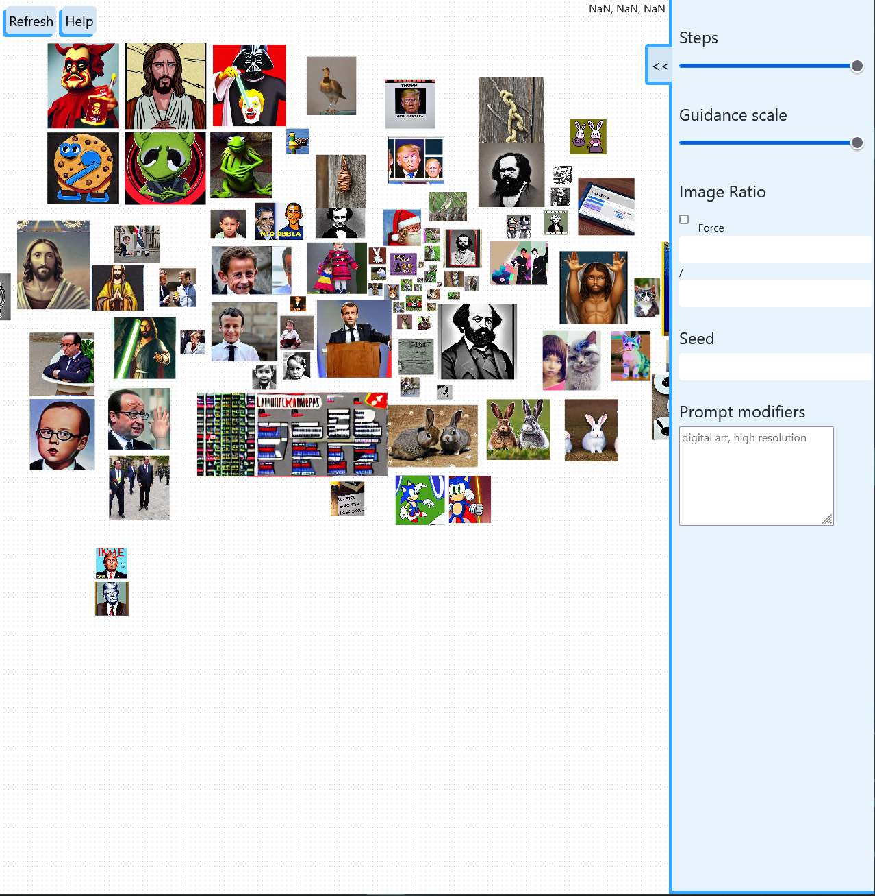
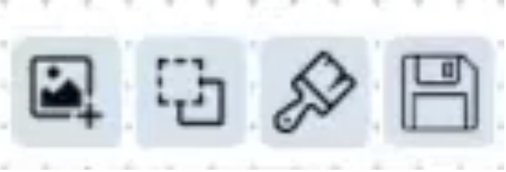
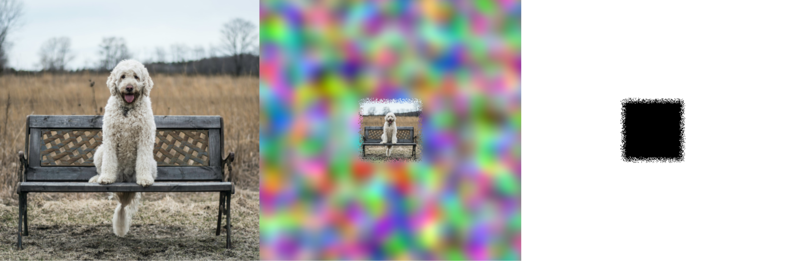
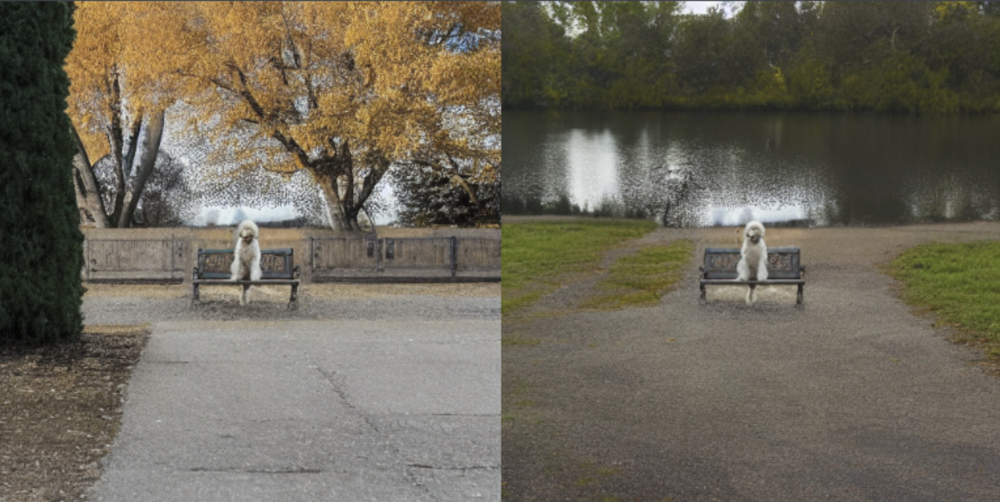

+++
title = 'Infinite Canvas: An Infinite Zoom Collaborative Canvas for Image Generation'
date = 2025-06-05T01:04:58+01:00
draft = false
+++

In the summer of 2022, diffusion models were beginning to become more and more capable. [DALLE 2](https://openai.com/dall-e-2) was just released by [OpenAI](https://openai.com) and a new open source competitor was just announced and seemed to be very promising : **[StableDiffusion](https://stability.ai/stable-diffusion)**.

Excited to try this new technology, some of us from [LatentMinds](https://latentminds.co) decided to work on a project to facilitate the use of this technology and make it available to a broader audience.

This is how the [InfiniteCanvas](https://canvas.koll.ai) project started. A multi user, multi resolution shared canvas for image generation with infinite zoom and no borders.
In the following weeks, we, [Philippe](https://www.linkedin.com/in/philippe-saad%C3%A9-26972b149/) and [Ruben](https://rubengres.com) spent long nights and questionable decisions to make this idea a reality.

Today the project is no longer active, but we figured we'll redact a short write-up to document our learnings and attest to the innovative approaches we had to invent at a time where diffusion models were only in their infancy.

## Building on a Budget
We had no funding to work on this project and at the time we just graduated and money was particularly tight. We had to make compromises and be clever in a lot of ways to keep costs low while avoiding to cut too many corners. Some of the design and infrastructure choices may now seem unorthodox, but they were mostly made to accommodate our low budget.

## How the canvas worked
The client is written in [React](https://react.dev) with a lot of custom javascript to handle the canvas elements The website worked on mobile and desktop and we always made sure to keep compatibility for all devices.

### Stretching out in all three directions
The leading idea behind the project was to have an infinite canvas that could stretch forever in all axes. X and Y axis are straightforward, even if not really infinite as we are limited by the maximum values of a float, but it's pretty big nonetheless.

Z axis was a bit harder to implement, we had to figure out a way to make an infinite zoom without degrading quality too much and keeping performances high.

The first step was pretty simple, inspired by spatial loading in video games, we only loaded the images that were in view of the camera. This is an improvement, but since we can zoom in indefinitely, images can be very small on the user screens but still take a long time to load. The fix was simple, if an image isn't occupying a lot of space on screen, we replaced it with a coloured rectangle of the average image pixel value. Finally we just had to save images in different levels of details and load them according to their scale and the canvas is done!

## Sharing the canvas with others
The canvas was shared for all users, this meant that the first time you logged in, you could see all of the generations that were made by others and add your own ideas to the canvas.

We synced all users using web sockets broadcasting every new image that was generated so everyone would see the piece update in real time. If you wanted to start fresh we also had a room system where you could have a specific theme or just play with your friends.

## Running a backend service on a budget

### Choosing a Cloud Provider

We went for [Google Cloud](https://cloud.google.com) for our cloud provider as it came with 300$ in free credits for new accounts and a friendly user interface. Again, no budget.

We made two environments for the development and production of the backend and the client. These two environments shared a common database, not really best practices but at least we didn't double our database costs. Google Cloud services made it easy to mirror our [GitHub](https://github.com) branches and deploy them to the correct environment with the right configuration.

### Avoiding GPU cost at all cost

To run the image generation models, we needed GPU compute and even if the image generation model only took 3GB of VRAM, GPUs aren't cheap.

To dodge this cost, we came up with a simple plan: freeloading [Google Colab](https://colab.research.google.com).

The method was simple, every user had to run a small jupyter notebook on any machine with a GPU. To make this simpler, we made a Google Colab as it is free for everyone with a Google account and really simple to set up. Running the script will give you an url to **InfiniteCanvas** linked to your device for the generation. And just like that, no GPU cost!

This worked for a while but Google Colab decided to ban AI image generation UIs in September 2023, one year after the project launched. Still, if you were motivated enough you could still download the notebook and run it on your machine.

### Storing images and coordinates
We needed to store all the user generated images as well as their coordinates in the canvas.
The images (~10 GB) were stored in a [Cloud Storage](https://cloud.google.com/storage) bucket while their location (~100 KB) were in a [Cloud SQL](https://cloud.google.com/sql) database. Despite the coordinates dataset being 100,000 times smaller than the images, their database cost us 100 times more in the long run! If we were to do it again we would use a cheaper service like [Firestore](https://firebase.google.com/products/firestore) that is only paid on use…

### Image generation and implementation details
The first model that we used was the original Lattent Diffusion Model. We used the provided inference script that we hacked to add the inpainting support. Then with the release of Stable Diffusion 1.1 to 1.5 we could rely on the easier to use [Hugging Face's](https://huggingface.co) Diffuser pipelines and scrap a lot of our custom code. As time went on and models improved the generations were better and better.

InfiniteCanvas had three modes of generations: New image, outpainting and image to image.

The basic generation and image-to-image were pretty straight forward to implement with existing tools but for the outpainting we had to make our own method since this technique was so early. Nowadays specialized inpainting models make it really straightforward but at the time we had to do everything manually.

Here is an example using a picture of a dog on a bench:
1. We fill the space around the image with RGB perlin noise.
2. We create a mask with noisy borders to hide the seam as much as possible
3. We apply the model using the mask to generate the missing part of the image.

In our application, one more step is needed to keep the infinite zoom possible. We cut out the masked region of the image so their original full size can be seen under it and maintain the infinite zoom. The final canvas resulted in a patchwork of half cut images overlayed on each other.

The seams are still quite noticeable, but for a very early solution this wasn't so bad.

## Sharing the website and aftermath

In November we made a Reddit post to advertise our project. This is the only time we talked about it and still got 57 unique users with 1040 generated pictures in a few days.
We had a few surprises with our small user base, only one user griefed by covering smaller images in the default room, while people continued existing works to form a collaborative collage.

In the end, even if the project was short lived it still allowed us to learn a lot of different technologies, platforms and low level AI tinkering. Though the project is now defunct, you can still watch it in action in [this YouTube playlist](https://www.youtube.com/watch?v=Rx_LL-SMYyw&list=PL7CV00e3X_pVhvbY91KX21bv3gSnBTzHN).

We still believe there is a strong potential in InfiniteCanvas and might go back to it to make a more modern (and cost effective….) version in the future. Stay tuned!