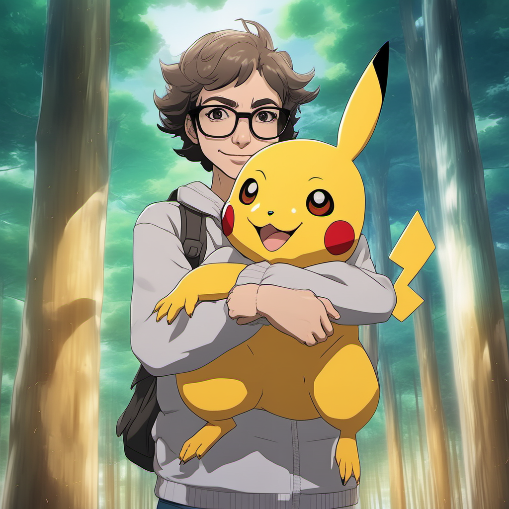

+++
title = 'Insert yourself in your favorite anime with IP Adapter Face'
date = 2023-11-05T01:04:58+01:00
draft = false
+++

## Introduction

* IP Adapter Face for Stable DIffusion XL was recently released
* I thought it would be like dreambooth without training
	* Sad that it's not great for photorealism
	* Happy that it's great for everything else!
* In this article I'll explain
	* a high level explanation of how IP Adapter works
	* how you can generate beautiful pics of yourself in different styles

%% Result table %%

## How IP Adapter works

%% Pic of uncanny result of IP adapter realist %%
## How to use IP Adapter Face to generate yourself in different styles

### Requierments

* A picture of yourself
* ComfyUI
* [ComfyUI IP Adapter Plus](https://github.com/cubiq/ComfyUI_IPAdapter_plus) custom node 

It should also works with Automatic1111's Stable Diffusion WebUI with ControlNet extension or other webui 

### Input picture

* You need a picture that clearly show your head
* The picture need to be a square
* Optional: increasing the sharpness helps having a more defined result [1]

%% ComfyUI workflow input image %%

[1] ref youtube comfuyui author
### Important parameters

Two parameters are important 

